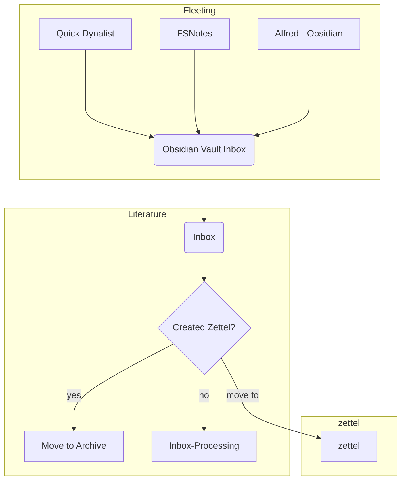

# My Note-taking Workflow

---

## Table of Contents

[TOC]


## Apps

### Obsidian

- Hotkeys
- Plugins
- is bidirectional - Link once!
-

#### Obsidian Setup

##### Vaults

- Research all in one - PhD-Dissertation –> Rename to research
- Projects Vault
- General Vault
  - Inbox for Fleeting
  - Inbox for literature repository
  - Inbox for literature processing
  -
  - Archive for zetteled literature
- Zettel vault
- MyLife

## Philosophy

### Three Types of Notes

#### Fleeting

##### Features

- Quick Notes

- Sudden Insights

- Highlights/Annotations

- Snippets

- Journaling

- Source for LitNotes

  - Storage from Joplin
  - Storage from Notion
  - Storage from to-be-processed sources


  ##### Rules

  - Need to be crossed out immediately in 2 days to Literature Notes/Zettels/Project Notes/Research Notes


  ##### App Requirements

  - Lightweight
  - Syncing
  - Cross Platform
  - Quickly Accessible
  - For notebooks - Portable

  ###### Mac

  - Via Alfred workflow for Obsidian

  ###### Android

  - Via Quick Dynalist

  ###### iPad

  - FSNotes

  ###### Linux

  - Standard Notes

  ###### Firefox

  - Dynalist clipper
  - Highligter snooze?

  ###### Physical

  - Pen Paper at all times
  - Menorah Notebook

  #### Obsidian

  - Import to `Inbox` folder
  - Move *highlights* to `Raw` folder
  - Move project related fleeting notes to respective folders

#### Literature


- ##### Features

  - Serves as both a **material-sheet** which is reviewable and converted to outliner skeleton post which archived

    - Inbox
    - Reference
    - Archive

  - Book Notes, Articles

  - Fleeting Notes –> Literatiure notes

  - Your *note-takings* like a register

  - Based upon a source -  textbook, book,lectures etc.

  - Made for further extraction i.e. Review purposes

  - Source for Zettels


    ##### Rules

    - Use tag #litnote in YAML
    - These are **permanent notes**
    - These are context based - *Little metadata and no links*
    - Title should reflect Source Material
    - Needs reference management - *Use Zotero*
    - **Processing rules**- Need to be outline based like Dynalist and short


    ##### Metadata Template

    ```YAML
    Author:
    Reference:
    Tags: litnote,
    ```


    ##### App Requirements

    - Editor and Reader
    - Syncing
    - Focus on Content writing instead of Metadata - *Dynalist*
    - Cross Platform
    - Export options
    - Database Qualities

    ###### Mac

    - Joplin
      - *Review of notes and further processing*
      - Sourcing ideas/annotations from a source-text through **FSNotes**
    - Obsidian
    - Dynalist - *For on the spot note-taking*
    - Zotero with Zotfile and Zotmd
    - Alfred Zotero Workflow

    ###### Android

    - Joplin
    -

    ###### iPad

    - Joplin

    ###### Linux

    - Joplin
    - Obsidian

    ###### Firefox

    - Joplin Clipper
    - Markdownload

    ###### Physical

    - Existing paper notes and iPad digital notes


    #### Obsidian

    - `Joplin` has raw storage of collected. fleeting notes and long form web clips
      - Through Joplin as reference via ipad
      - `Joplin Web clips`
      - `Markdownload`
      - Joplin Inbox for all other long form apps like Notion
      - Within Joplin convert to outliner
      - Export to Obsidian Inbox when outlining complete
    - Import from `Dynalist`  to `Inbox` folder
    - After Zettel has been made, thye literature note can be forgotten about and moved to `Archive` folder
    - Move project related fleeting notes to respective folders
    - Zotero annotations from `Zotfile` . Import to Obsidian

---


#### Zettels


- ##### Features

  - Single concept atomic notes which are serendipitious

  - No redundancies - *largest entropy*

  - Fully developed notes in publishable form and written in your own words as if teaching

  - Have well developed template, metadata and heavily linked

  - Builds from `Fleeting Notes` and `Literature Notes`

  - Independently understandable

  - Size ranges from a tweet(ie 4-5 lines to 300-500 words)

  - Keep the links metadata section to remind you in the future to establish connections between your notes


    #### Metadata

    ```markdown
    #refnote
    ---
    
    !.[]({{image_url}})
    
    ### Metadata
    - Author: [[{{author}}]]
    - Full Title: {{full_title}}
    - Category: #{{category}}
    - URL: {{url}}
    ### Literature Notes
    dataview
    TABLE rows.file.link AS “Literature Note”, rows.file.cday AS “Date”
    FROM #litnote AND [[{{ title }}]]
    GROUP BY file.link
    sort date ASCENDING

    ```

    #### Simpler Metadata

    ```yaml
    topic:
    links:
    tags:
     #permanent-note

    ```


    ##### Rules


    - Only those notes are settles which satisfy the need of
      - Future Information retrieval
      - Something which must be learned
    - Use tags liberally in YAML metadata and use nested tags #foo/bar
    - Keep the links metadata section to remind you in the future to establish connections between your notes
    - Well developed template for Zettelkasten
    - No copy paste
    - Choice of keywords not in classification i.e. don't be an archivist but as a writer. Ask the question
      - a
      - Say a wikilink is a species. Tags are just one or two order removed. Don't use subject tags like economics, philosophy. Use what you'll use to find a concept in library
      - How'd you like to stumble upon the said note in future. #uncertaintyPrinciple etc


    ##### Order from Chaos

    > Avoid the temptation to impose a hierarchical structure from the index down by refactoring ZettelkastenIDs as topics emerge.

    ###### Note Sequences

    - Prompts for a Note sequence given a zettel
      - What ideas does this zettel(n_i) spark? –> n_i+1
      - If this zettel(n_i) used to write an essay, what information is missing? –> n_i+1
      - What does this zettel(n_i) remind me of that I've read before? –> n_i+1
    - A referenced note automatically becomes a part of a sequence (a graph line segment)
    - A sequence of notes with many follow-up notes  become hubs - i.e. main topics and sub-topics. Thus topics emerge out of note sequences
    - Eventually Note Sequences develop to a point we can say we have a meaningful path and we need an overview

    ###### Topic and Sub-Topic Notes

    - Topic notes introduce a weak ordering system to a zettelkasten. Provide an entry point to a line of thought.
    - The index of a group of zettels eventually updated to a topic
    - Topic Notes are in the middle way between an outline and a published text
    - Can be used as a *scratch-pad*
    - *Unanswered questions* in the line of thought can be put in the bottom of a topic note such as *missing pieces* or *relevance to other notes*
    - No more than 25 links for a topic note
    - The links accompanied with 1-2 lines descriptions of content

    ###### Index Notes

    - Hide index notes from plugin views
    - Index Notes should be less required in the long term once topics and sub-topics emerge. The links then moved there from the index.
    - Also known as Map of Content. Serve as overviews of topics/sub-topics.
    - Index notes analogy and named as sections or genres in a library. It should answer the following question
      - If I were to find this information(the zettel) in a bookstore, which section would I find it under? The answer is the name of index note
    - **template** contains the tag #index-note and H3- Key Concepts

---

### Special kinds

#### Project

- Meant to be discarded/deleted after project completion
- Contains project specific *reminders,todos,outlines,drafts*
- Can be hierarchical and folder based
- Inbox contains all attachments images and pdfs regarding that project
- Transfer insights into lit notes->zettels
- Book Notes, Essays

#### Research All in One

- Special Obsidian Vault for research and contains all in one
  -  Literature Notes - Reference Notes-Inbox
  - Literature Notes - Reference-Archive(only if zetteled)
  - Zettels
  - Fleeting Notes - Inbox
  -

## WorkFlowchart



## Efficiency Apps

### PopClip

### Alfred Workflows

- Zothero

### Keyboard maestro

### Syncthing

## Information Sources

### Raindrop

Bookmark Manager

### Feedly/Reeder/Pocket

- RSS news feeds
- reddit
- Blogs
- Journals

### OCR

- Devonthink for scans
- Adobe scan to capture paper notes


## Miscellaneous

### Favourite Fonts

#### Typing

- iA Writer Mono V

#### Reading

- iA Writer Quattro V

#### Code

- Fantasque Sans Mono
- Cascadia Code

### Favourite Theme

- Dracula
- Monokai

### Static Site Generators

- Hugo - Fast, Themes
- Jekyll - Themes, Github Pages
- MkDocs - gitbook
- Eleventy - Quickest, deploys to Netlify

### Libraries

- Mermaid - Flowcharting by text
- Pandoc - Document conversion
- MARP - markdown based presentations beamer style

### Markdown Writing

- Typora
- Ulysses


---

