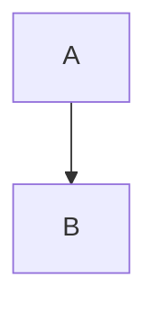

# Heading

This is a **heading**

## Sub-heading

- this is a list
- this is second
  - indent
- outdent

---

> abcdef

`abc`

```
abcdef
```

==a==

::A::

[[a]]



|a|    A | B |
|---|---|---|
|def|  0|  5|
|abc|  7|  6|

abc[^abc]

def

[1]: What?

$x^2$

$$
\alpha+\beta
$$